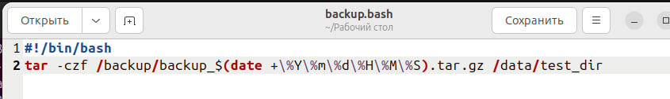
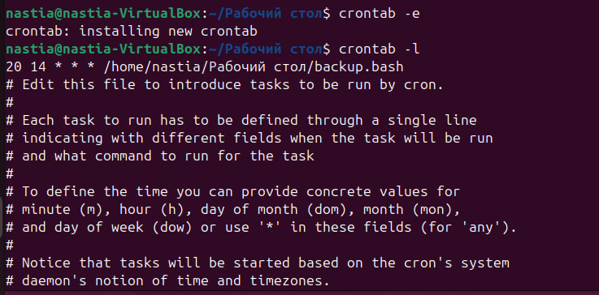
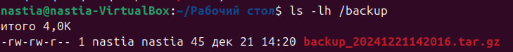
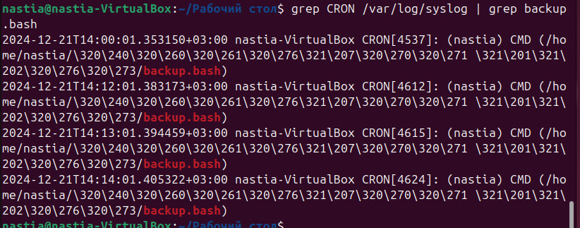

# Панас Анастасия Андреевна, группа K3162, номер ИСУ 467006

1. Прежде всего я создала директорию _/data/test_dir_

```sudo mkdir -p /data/test_dir```

2. Добавила файлы в директорию

```
sudo bash -c 'echo "Test file 1" > /data/test_dir/test1.txt'
sudo bash -c 'echo "Test file 2" > /data/test_dir/test2.txt'
```
3. Проверила, что каталог создан и проверила права на него

```ls -ld /data/test_dir```

Изменила владельца каталога и выдала себе права

```sudo chown $USER:$USER /data/test_dir```

4. Создала файл _backup.bash_, открыла его при помощи gedit и внеслла туда скрипт для архивации содержимого /data/test_dir



```tar -czf``` — команда для создания сжатого архива

```/backup/backup_$(date +%Y%m%d%H%M%S).tar.gz``` — архив будет создан в директории /backup с именем, включающим текущую дату и время

```/data/test_dir``` — директория, содержимое которой будет архивироваться

Выдала права, чтобы скрипт был исполняемым:

```chmod +x backup.bash```

5. Открыла _crontab_ для редактирования

```crontab -e```

Сперва добавила задание, чтобы скрипт выполнялся каждую минуту, чтобы проверить исполнение, а потом добавила ежедневное исполнение в 14:20



6. Выполнила проверку, что файлы появляются в директории



7. Проверила логи

